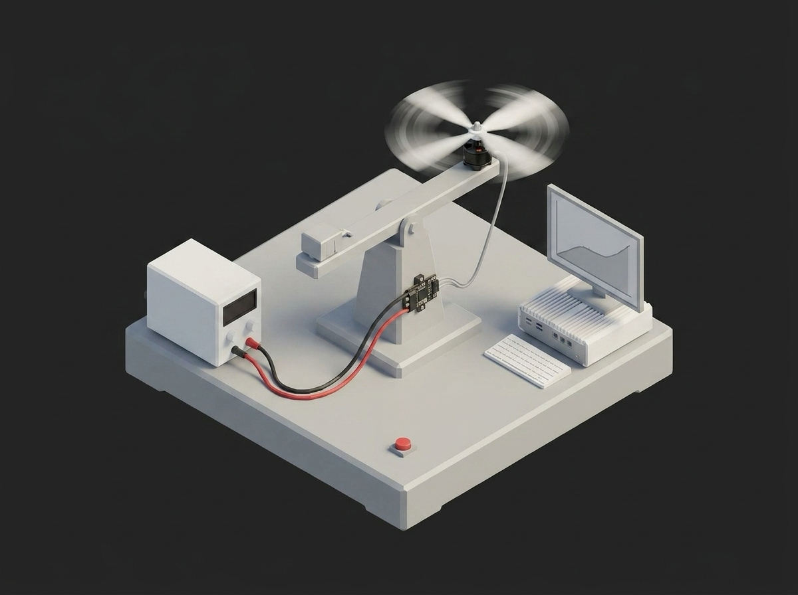

# Framework Propeller Thrust and Efficiency Curve



A TofuPilot Framework procedure that measures a drone propulsion system (motor + propeller + ESC) at end-of-line. Zeroes the bench in a setup stage, sweeps throttle while logging thrust, torque, RPM, and electrical power, computes the efficiency curve, hover-point efficiency, peak thrust, and figure of merit, and always powers the bench down in a teardown stage.

## What This Shows

| Feature | Where |
|---------|-------|
| Setup / teardown stages | `procedure.yaml` -- `setup: zero_bench`, `teardown: power_down` (teardown runs even when a main phase fails) |
| Plug `config` mapping | `procedure.yaml` -- bench address and sample rate passed as `__init__` kwargs |
| Two instances of one plug class | `temp_stator` / `temp_esc`, both `plugs.temp_probe:TempProbe` with different configs |
| Run metadata | `setup/zero_bench.py` -- `run.metadata` (line, prop lot, ambient temperature) |
| Aggregation validators | `min` / `max` / `mean` / `p2p` on numeric arrays in `procedure.yaml` |
| Plug state across phases | `phases/compute_efficiency.py` -- `bench.last_sweep()` reuses data captured by the sweep phase |
| Multi-dimensional charts | `thrust_curve` and `efficiency_curve` measurements |

## Get Started

1. Sign up for a free TofuPilot account at [tofupilot.app](https://www.tofupilot.app/auth/signup).
2. Open the **New Procedure** flow in the dashboard and clone this template.
3. Follow the dashboard's instructions to set up a station and run the procedure.

For deeper guides, see the [TofuPilot docs](https://www.tofupilot.com/docs/framework) and the [Propeller Thrust and Efficiency Curve template page](https://www.tofupilot.com/templates/propeller-thrust-and-efficiency-curve).

## Run It

```bash
tofupilot run .
```

The procedure has no operator input components, so it runs unattended end to end.

## Structure

```
.
├── procedure.yaml                    # Procedure, plugs, setup/main/teardown, measurements
├── setup/
│   └── zero_bench.py                 # Zero offsets, stamp run metadata
├── phases/
│   ├── throttle_sweep.py             # Stepped sweep with thermal monitoring
│   └── compute_efficiency.py         # Efficiency curve, hover point, FoM
├── teardown/
│   └── power_down.py                 # Always runs, disarms the bench
├── plugs/
│   ├── bench.py                      # Mock flight stand plug (momentum-theory model)
│   └── temp_probe.py                 # Temperature probe plug (two instances)
├── utils/
│   └── propulsion.py                 # Thrust/torque fits, efficiency, figure of merit
├── pyproject.toml                    # uv-managed Python project
└── README.md
```

## Replace the Mock with Real Hardware

`plugs/bench.py` models a 9-inch propulsion system with momentum theory. To run against a physical stand, swap it for a plug that drives your bench -- for a Tyto Robotics Flight Stand, the official Flight Stand software Python API is the integration path. The stage structure, validators, and analysis stay the same.
